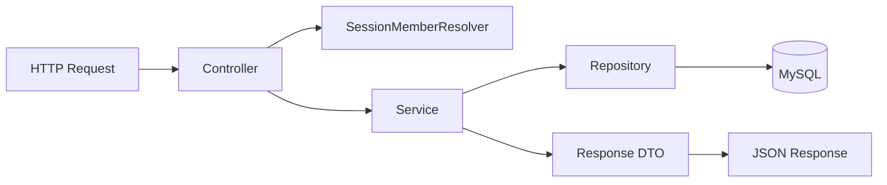

# BullBoard

미국 주식 투자자를 위한 커뮤니티 서비스입니다.

Spring Boot와 Spring Data JPA 기반으로 회원 인증, 게시글·댓글 CRUD, 좋아요, 검색·페이징, 인기 게시글 기능을 구현했습니다.

## 기술 스택

- Java 17
- Spring Boot 3.5
- Spring MVC
- Spring Data JPA
- Bean Validation
- MySQL
- BCrypt
- Gradle

## 백엔드 구조



- **Controller**: URL 매핑, 요청값 검증, HTTP 상태 코드 반환
- **Service**: 비즈니스 규칙, 권한 검사, 트랜잭션 처리
- **Repository**: Spring Data JPA 기반 조회 및 변경 쿼리
- **Domain**: 회원, 게시판, 게시글, 댓글, 좋아요 엔티티
- **DTO**: 요청·응답 모델 분리 및 엔티티 내부 정보 보호

## 주요 기능

### 회원과 인증

- 이메일·닉네임 중복 검사 회원가입
- 영문·숫자·특수문자를 포함한 8자 이상 비밀번호 검증
- BCrypt 비밀번호 암호화
- 세션 기반 로그인 및 로그아웃
- 회원가입 완료 시 자동 로그인
- 로그인 회원 정보 조회 및 수정
- 회원 탈퇴 시 게시글·댓글 유지 및 작성자 익명화
- 회원 API 응답에서 비밀번호 제외

### 게시판과 게시글

- 기본 게시판 자동 생성
  - 자유게시판
  - 종목 토론
  - 투자 질문
  - 포트폴리오
- 게시글 작성·조회·수정·삭제
- 작성자만 게시글 수정 및 삭제 가능
- 게시판, 제목·내용 검색어, 종목 심볼 필터
- 최신순·조회순 정렬
- 페이지 번호와 크기를 이용한 페이징
- 게시글 상세 조회 시 조회수 원자적 증가
- 게시판 삭제 시 소속 게시글·댓글·좋아요 연쇄 삭제

### 댓글

- 게시글별 댓글 목록 조회
- 로그인 회원 댓글 작성
- 작성자만 댓글 수정 및 삭제 가능
- 회원 탈퇴 후 댓글 유지 및 작성자 `알 수 없음` 처리

### 좋아요와 인기 게시글

- 게시글 좋아요 등록 및 취소
- 좋아요 개수와 로그인 회원의 좋아요 여부 조회
- 회원과 게시글 조합에 유니크 제약을 적용해 중복 좋아요 방지
- 최근 7일 게시글을 좋아요 수로 정렬
- 좋아요 수가 같으면 최신 게시글 우선

## API

### 인증과 회원

| Method | Endpoint | 설명 | 인증 |
|---|---|---|---|
| `POST` | `/members` | 회원가입 및 자동 로그인 | 불필요 |
| `POST` | `/login` | 로그인 | 불필요 |
| `POST` | `/logout` | 로그아웃 | 필요 |
| `GET` | `/me` | 내 정보 조회 | 필요 |
| `PUT` | `/me` | 내 정보 수정 | 필요 |
| `DELETE` | `/me` | 회원 탈퇴 | 필요 |

### 게시판과 게시글

| Method | Endpoint | 설명 | 인증 |
|---|---|---|---|
| `GET` | `/boards` | 게시판 목록 | 불필요 |
| `GET` | `/boards/{id}` | 게시판 단건 조회 | 불필요 |
| `POST` | `/articles` | 게시글 작성 | 필요 |
| `GET` | `/articles` | 게시글 검색·정렬·페이징 | 불필요 |
| `GET` | `/articles/{id}` | 게시글 상세 조회 및 조회수 증가 | 불필요 |
| `PUT` | `/articles/{id}` | 게시글 수정 | 작성자 |
| `DELETE` | `/articles/{id}` | 게시글 삭제 | 작성자 |
| `GET` | `/articles/trending?size=3` | 좋아요 기반 인기 게시글 | 불필요 |

게시글 목록 조회 예시:

```http
GET /articles?boardId=1&keyword=금리&symbol=NVDA&sort=latest&page=0&size=20
```

### 댓글과 좋아요

| Method | Endpoint | 설명 | 인증 |
|---|---|---|---|
| `GET` | `/articles/{articleId}/comments` | 댓글 목록 | 불필요 |
| `POST` | `/articles/{articleId}/comments` | 댓글 작성 | 필요 |
| `PUT` | `/comments/{id}` | 댓글 수정 | 작성자 |
| `DELETE` | `/comments/{id}` | 댓글 삭제 | 작성자 |
| `GET` | `/articles/{articleId}/likes` | 좋아요 수와 상태 조회 | 불필요 |
| `POST` | `/articles/{articleId}/likes` | 좋아요 등록 | 필요 |
| `DELETE` | `/articles/{articleId}/likes` | 좋아요 취소 | 필요 |

## 핵심 설계

### 세션 인증

세션에는 회원 객체 전체가 아닌 회원 ID만 저장합니다. 로그인 성공 시 기존 세션을 폐기하고 새 세션을 발급해 세션 고정 공격 위험을 줄였습니다.

### 트랜잭션과 변경 감지

서비스 계층은 기본적으로 `@Transactional(readOnly = true)`를 사용합니다. 데이터가 변경되는 메서드에만 `@Transactional`을 적용하고, 영속 엔티티 수정은 JPA 변경 감지로 반영합니다.

### 조회수 증가

조회 후 Java에서 값을 증가시키지 않고 다음 JPQL 벌크 업데이트를 사용합니다.

```java
update Article a
set a.viewCount = a.viewCount + 1
where a.id = :id
```

쿼리 수를 줄이고 동시에 상세 조회가 발생했을 때 조회수 손실 가능성을 낮춥니다.

### 인기 게시글

게시글과 좋아요를 `LEFT JOIN`한 뒤 게시글별 좋아요 수를 집계합니다. 좋아요가 없는 게시글도 포함하고, 최근 7일 범위에서 좋아요 수와 작성 시각으로 정렬합니다.

### 회원 탈퇴 정책

회원 탈퇴 시 작성한 게시글과 댓글은 커뮤니티 기록으로 유지합니다. 게시글과 댓글의 작성자 외래키를 `NULL`로 변경한 후 회원을 삭제하며, 응답 DTO에서는 작성자를 `알 수 없음`으로 변환합니다.

## HTTP 상태 코드

- `200 OK`: 조회·수정 성공
- `201 Created`: 회원·게시글·댓글 생성 성공
- `204 No Content`: 로그아웃·삭제 성공
- `400 Bad Request`: 요청값 또는 비밀번호 확인 오류
- `401 Unauthorized`: 로그인 필요 또는 로그인 실패
- `403 Forbidden`: 작성자 권한 없음
- `404 Not Found`: 대상 리소스 없음
- `409 Conflict`: 이메일 또는 닉네임 중복

## 실행 방법

Java 17과 MySQL이 필요합니다. 데이터베이스를 준비한 뒤 설정에 접속 정보를 입력하고 실행합니다.

```bash
./gradlew bootRun
```

테스트:

```bash
./gradlew test
```

배포용 JAR 생성:

```bash
./gradlew clean build
```

```bash
java -Duser.timezone=Asia/Seoul -jar build/libs/demo-0.0.1-SNAPSHOT.jar
```
